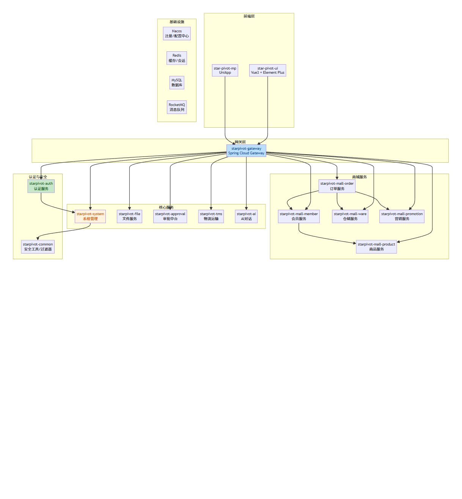
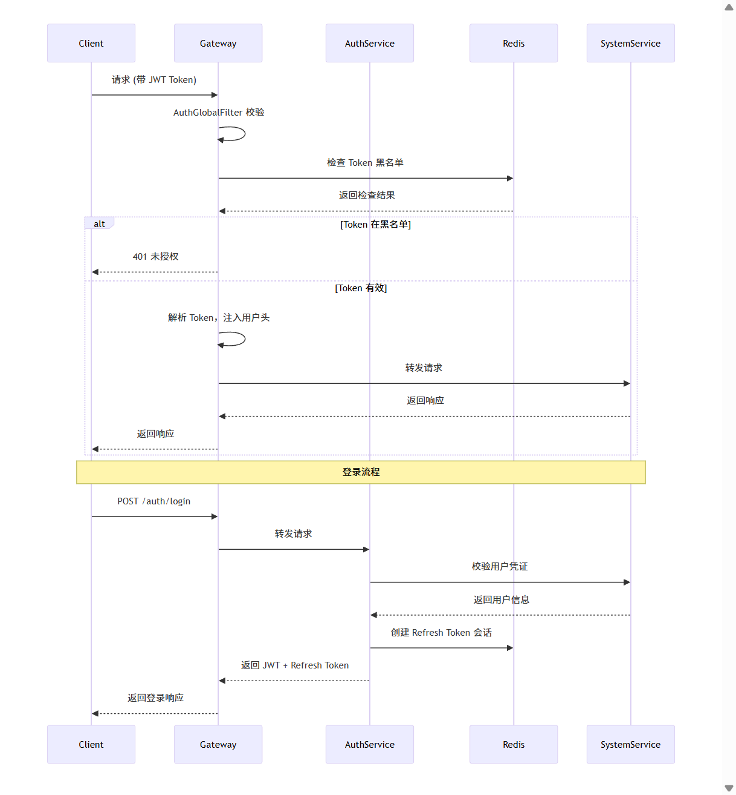

# Starpivot Cloud 文档

## 项目概述

Starpivot Cloud 是一个基于 Spring Cloud Alibaba 的微服务架构系统，提供完整的企业级解决方案。

## 模块架构

## 请求认证流程

## 文档目录

| 文档 | 说明 |
|------|------|
| [CHANGELOG-20260714.md](CHANGELOG-20260714.md) | 2026年7月14日代码审查修复变更日志 |
| [模块架构图.md](模块架构图.md) | 模块架构图 Mermaid 源码 |
| [请求认证流程图.md](请求认证流程图.md) | 请求认证流程图 Mermaid 源码 |
| [Java微服务版本审批中心设计方案.md](Java微服务版本审批中心设计方案.md) | 审批中心设计方案 |
| [docker-deploy.md](docker-deploy.md) | Docker 部署文档 |
| [alipay-sandbox-setup.md](alipay-sandbox-setup.md) | 支付宝沙箱配置 |

## 子目录

- **doc/** - 业务模块文档
- **security/** - 安全相关文档