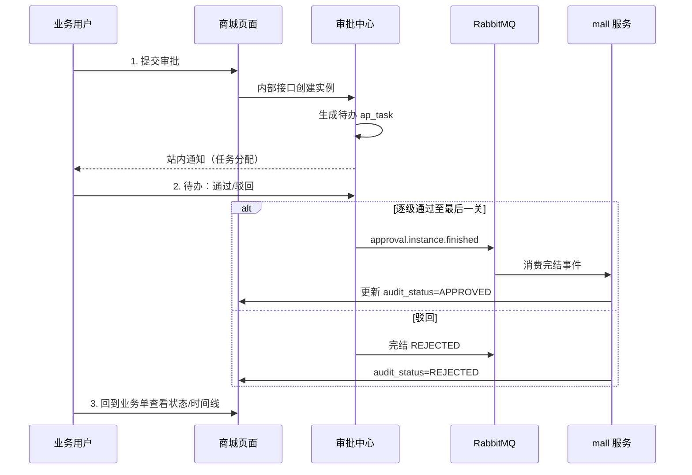

# 审批业务流程测试指南

本文档说明如何在 **StarPivot 管理端** 分步骤验证审批中心与商城业务联动，适用于功能验收、回归测试与新成员上手。

---

## 1. 测试前准备

### 1.1 启动服务

| 服务 | 端口（默认） | 说明 |
|------|-------------|------|
| gateway | 8080 | 统一入口 |
| starpivot-auth | 9200 | 登录、验证码 |
| starpivot-system | 9201 | 用户/角色/菜单 |
| starpivot-approval | 9213 | 审批引擎 |
| starpivot-mall | 9205 | 商城业务 + MQ 消费 |
| RabbitMQ | 5672 / 15672 | 审批完结事件（建议开启） |
| MySQL | 3307 | `star_pivot` + `star_pivot_mall` |

前端：`star-pivot-ui` 开发服务或打包后由网关/static 提供。

### 1.2 执行 SQL 补丁（按顺序，仅首次或升级时）

```bash
mysql -u root -p star_pivot_mall < sql/patch_approval_extend.sql
mysql -u root -p star_pivot       < sql/patch_approval_extend.sql   # 脚本内会 USE star_pivot 写模板
mysql -u root -p star_pivot       < sql/patch_approval_notify.sql
mysql -u root -p star_pivot       < sql/patch_approval_phase3.sql
```

执行后 **重启 starpivot-approval、starpivot-mall**。

### 1.3 MQ 与环境变量

- Nacos / 环境：`MQ_ENABLED=true`（对应商城微服务需消费 `approval.instance.finished.mall.{bizType}` 才能回写业务单状态）
- 各服务 `INTERNAL_SERVICE_TOKEN` 保持一致（mall 调用 approval 内部接口）

### 1.4 测试账号建议

| 账号 | 用途 | 说明 |
|------|------|------|
| admin | 发起人 + 审批人 | 默认具备 `finance` 角色，可一人跑通采购两关 |
| 普通业务用户 | 仅发起 | 无 finance 角色，用于验证「待办在他人处」 |
| 财务专用账号 | 第二关审批 | 角色 `finance`，用于分账号测试 |

**角色与模板对应关系（默认种子）：**

| 步骤策略 | 含义 | 默认模板中的步骤 |
|----------|------|------------------|
| DEPT_LEADER | 发起人部门负责人 | 采购/退货第 1 关 |
| ROLE + finance | 拥有 finance 角色的用户 | 采购/退货/优惠券第 2 关 |

在 **系统管理 → 角色管理** 中确认测试用户已分配对应角色；修改角色后需 **重新登录**。

### 1.5 菜单与权限

登录后左侧应可见 **审批中心**：

| 菜单 | 权限标识 | 作用 |
|------|----------|------|
| 审批模板 | approval:template:query | 配置步骤、路由、超时 |
| 业务绑定 | approval:bind:edit | 业务类型 → 模板 |
| 待办审批 | approval:task:query / action | 通过、驳回 |
| 我发起的 | approval:instance:query / withdraw | 查看进度、撤回 |
| 审批统计 | approval:statistics:query | 数据看板 |

---

## 2. 业务流程总览



**业务单 `audit_status` 含义：**

| 值 | 说明 |
|----|------|
| DRAFT | 草稿，可提交审批 |
| PENDING | 审批中 |
| APPROVED | 已通过 |
| REJECTED | 已驳回 |
| WITHDRAWN | 已撤回 |

---

## 3. 场景 A：采购单审批通过（推荐首测）

> 默认模板 `mall_purchase_default`：**部门负责人 → 财务审批**（两关）。

### 步骤 1：准备业务数据

1. 登录管理端（建议 `admin`）。
2. 进入 **商城 → 仓储 → 采购单**。
3. 新建或选择一条 **`audit_status = DRAFT`（草稿）** 的采购单，并保存明细。

### 步骤 2：提交审批

1. 打开采购单 **详情**（列表点「详情」或行操作）。
2. 点击 **「提交审批」**。
3. **预期：**
   - 提示提交成功；
   - 详情中 `audit_status` 变为 **审批中（PENDING）**；
   - 出现 **审批时间线** 组件。

### 步骤 3：处理第一关（部门负责人）

1. 进入 **审批中心 → 待办审批**，切到 **「待办」** Tab。
2. 找到标题含「采购单审批」的记录。
3. 点击 **「通过」**，审批意见可填可不填，确定。
4. **预期：** 该待办消失；时间线出现「部门负责人 / 通过」。

> 若待办为空：当前登录用户不是该步骤审批人。用 admin（同部门负责人 + finance）或切换对应账号。

### 步骤 4：处理第二关（财务）

1. 仍在 **待办审批**，处理 **「财务审批」** 待办，点击通过。
2. **预期：**
   - 待办清空（该实例无进行中任务）；
   - **我发起的** 中该实例状态为 **已通过**。

### 步骤 5：回到业务单验收

1. 返回 **采购单详情**。
2. **预期：** `audit_status = APPROVED`；时间线完整；可进行后续入库等操作（视业务规则）。

### 步骤 6：数据与 MQ 验收（可选）

```sql
-- 业务库
SELECT id, audit_status, approval_instance_id
FROM star_pivot_mall.wms_purchase
WHERE id = <采购单ID>;

-- 审批库
SELECT instance_id, status, finish_time
FROM star_pivot.ap_instance
WHERE biz_key = CONCAT('mall:purchase:', <采购单ID>);
```

RabbitMQ 管理台 → 对应队列（如采购：`starpivot.mall.approval-finished.purchase`）：最后一关通过后应有消息投递与 Ack。

---

## 4. 场景 B：审批驳回（必填意见）

### 操作步骤

1. 再选一条 **DRAFT** 采购单，**提交审批**。
2. **审批中心 → 待办** → 点击 **「驳回」**。
3. **不填意见** 点确定 → **预期：** 前端提示「驳回时必须填写审批意见」，无法提交。
4. 填写意见如「金额有误，请修改」，再提交驳回。
5. **预期：**
   - 实例状态 **已驳回**；
   - 采购单 `audit_status = REJECTED`；
   - 时间线记录动作为驳回，带意见。

---

## 5. 场景 C：发起人撤回

### 操作步骤

1. 提交一条新采购单审批（进入 PENDING）。
2. 进入 **审批中心 → 我发起的**。
3. 对 **审批中** 的记录点击 **「撤回」**，确认。
4. **预期：**
   - 实例状态 **已撤回**；
   - 所有未处理待办被取消；
   - 采购单 `audit_status = WITHDRAWN`；
   - 可修改后再次提交（回到 DRAFT 或允许重新提交的状态，视业务实现）。

> 仅 **发起人** 可撤回；审批人无法撤回。

---

## 6. 场景 D：其他商城业务类型

以下流程与采购单相同：**业务页提交 → 待办审批 → 回到业务页看状态**。默认模板见 `sql/patch_approval_extend.sql` 与 `star_pivot.ap_template_bind`。

| 业务 | 菜单路径 | 提交入口 | biz_type | 默认模板 |
|------|----------|----------|----------|----------|
| 采购单 | 商城 → 仓储 → 采购单 | 详情「提交审批」 | purchase | mall_purchase_default |
| 退货单 | 商城 → 订单 → 退货单 | 详情「提交审批」 | return | mall_return_default |
| 优惠券 | 商城 → 营销 → 优惠券 | 列表/详情「提交审批」 | coupon | mall_coupon_default |
| 商品 SPU | 商城 → 商品 → 商品管理 | 列表「提交审批」 | spu | mall_spu_default |

### 优惠券 / SPU 通过后

- 优惠券：可 **发布**（未审批通过时发布应被拦截）。
- 商品：可 **上架**（须先审批通过）。

### 待办跳转业务单

在 **待办审批** 打开通过/驳回弹窗时，若配置了业务导航，可点击 **「查看采购单」** 等按钮跳转到对应业务详情（带 `openId` 参数自动打开抽屉）。

---

## 7. 场景 E：站内通知

### 操作步骤

1. 用户 A 提交采购单审批。
2. 用户 B（第一关审批人）登录。
3. 进入 **审批中心 → 待办审批**，点击右上角 **「通知」**。
4. **预期：**
   - 未读角标 +1；
   - 列表出现 **任务分配** 类通知；
   - 点击可定位到相关审批/时间线。

5. 全部审批结束后，**发起人** 应收到 **实例完结** 通知（通过/驳回/撤回）。

---

## 8. 场景 F：超时自动处理

> 需已执行 `sql/patch_approval_phase3.sql` 且 `starpivot-approval` 已重启（定时任务默认每 60 秒扫描）。

### 配置步骤

1. **审批中心 → 审批模板** → 编辑目标模板（须为 **草稿** 状态才可改；已发布需复制新版本）。
2. 在某步骤设置：
   - **超时(小时)**：测试可填 `0.05`（约 3 分钟，生产建议 ≥1）；
   - **超时策略**：`超时自动驳回` 或 `超时自动通过`。
3. **保存** → **发布** 模板。

### 验证步骤

1. 提交一条会进入该步骤的业务审批。
2. 审批人 **不做任何操作**，等待超过设定时长。
3. **预期：**
   - 定时任务触发后，实例按策略自动通过或驳回；
   - 时间线出现 **超时处理** 记录；
   - 业务单 `audit_status` 同步更新；
   - **审批统计 → 已超时待办** 在超时前可能 >0，处理后归零。

---

## 9. 场景 G：审批统计看板

1. 进入 **审批中心 → 审批统计**。
2. 业务域选 **全部** 或 **商城 (mall)**，点击 **查询**。
3. **预期展示：**
   - 实例概览：总数、审批中、已通过、已驳回等；
   - 任务与时效：待办、超时待办、平均完结时长；
   - 近 30 日完结趋势、实例状态环形图；
   - 业务类型明细表（通过率进度条）。
4. 完成场景 A～F 后刷新，指标应随之变化。

---

## 10. 场景 H：模板与业务绑定（配置类）

### 10.1 新建/编辑模板

1. **审批中心 → 审批模板 → 新建模板**。
2. 填写模板编码、名称、业务域（如 `mall`）。
3. 配置 **审批步骤**：
   - 步骤编码 / 名称 / 顺序；
   - 审批人策略：发起人、部门负责人、角色、岗位、指定用户；
   - 通过模式：或签（ANY）/ 会签（ALL）；
   - 跳过表达式（SpEL，可选）；
   - 超时小时 + 超时策略（可选）。
4. 配置 **条件路由**（可选）：某步骤完成后按 SpEL 跳转不同下一步。
5. **保存**（草稿）→ **发布**（仅发布后可被实例使用）。

### 10.2 业务绑定

1. **审批中心 → 业务绑定 → 新增**。
2. 选择 `biz_module`（如 mall）、`biz_type`（如 purchase）、绑定模板编码。
3. 可选 **match_expr**（SpEL）实现按金额等条件选不同模板。
4. 保存后，新发起的审批按绑定规则解析模板。

---

## 11. 快速 API 测试（可选）

网关前缀：`http://localhost:8080/api/v1`，Header：`Authorization: Bearer <token>`。

```bash
# 1. 提交采购单审批
POST /mall/purchase/{id}/submit-approval

# 2. 待办列表
POST /approval/task/todoTaskPageList
Body: {"pageNum":1,"pageSize":10}

# 3. 通过
POST /approval/task/approve
Body: {"taskId": 1, "comment": "同意"}

# 4. 驳回（comment 必填）
POST /approval/task/reject
Body: {"taskId": 2, "comment": "不同意"}

# 5. 撤回
POST /approval/instance/{instanceId}/withdraw

# 6. 统计看板
GET /approval/statistics/dashboard?bizModule=mall
```

---

## 12. 常见问题

| 现象 | 可能原因 | 处理 |
|------|----------|------|
| 待办列表为空 | 当前用户不是该步骤审批人 | 检查 `ap_task.assignee_id`、模板步骤策略、用户角色/部门 |
| 提交审批失败 | 已有进行中实例 | 同一 biz_key 不允许重复 RUNNING 实例；先撤回或等完结 |
| 通过后业务单仍 PENDING | mall 未消费 MQ | 确认 MQ 开启、mall 已启动、队列无堆积 |
| 看不到审批统计菜单 | 未执行 phase3 SQL 或未授权 | 执行补丁；角色勾选 `approval:statistics:query` 后重登 |
| 驳回无校验 | 前端缓存旧代码 | 强刷浏览器；后端 `ApTaskServiceImpl` 也会校验 |
| 超时未自动处理 | 步骤未配 timeout_hours 或 approval 未重启 | 检查模板与 `starpivot.approval.timeout-scan-ms` |

---

## 13. 建议测试顺序（Checklist）

- [ ] 环境 + SQL + 服务就绪
- [ ] 场景 A：采购单两关通过
- [ ] 场景 B：驳回 + 必填意见
- [ ] 场景 C：撤回
- [ ] 场景 D：至少再测一种业务（退货 / 优惠券 / SPU）
- [ ] 场景 E：站内通知
- [ ] 场景 F：超时（短超时快速验证）
- [ ] 场景 G：统计看板数据一致
- [ ] SQL + MQ 抽检

---

## 14. 相关文档

- [README.md](../../README.md) — 采购审批 MQ 场景与 curl 示例
- [mq-usage.md](./mq-usage.md) — RabbitMQ 队列说明
- `sql/patch_approval_*.sql` —  incremental 数据库补丁
