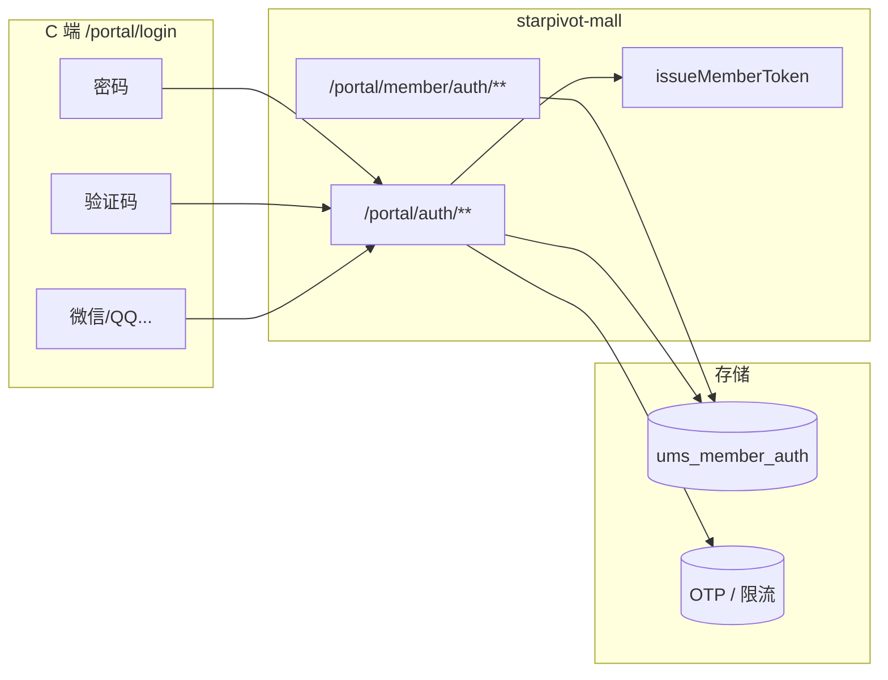

# C 端会员认证方案总览

> **模块**：`starpivot-mall`（`/portal`） · **前端**：`star-pivot-ui/views/portal`  
> **目标**：支持密码、手机号、微信、QQ 等多种登录方式；**一个会员账号可绑定多种登录方式（一对多）**，体验对齐京东账号体系。  
> **详细 P1 设计**：[portal-auth-p1-design.md](./portal-auth-p1-design.md) · **DDL**：[sql/patch_portal_member_auth.sql](../../sql/patch_portal_member_auth.sql)

---

## 1. 背景与现状

### 1.1 当前能力

| 项 | 现状 |
|----|------|
| C 端登录 | 仅 **账号 + 密码**（`account` 支持用户名或手机号） |
| 账号体系 | `ums_member`，与后台 `sys_user` **完全隔离** |
| 认证 | 会员 JWT，角色 `MEMBER`，与后台共用 `JwtUtils` |
| 第三方 | `ums_member.social_uid` 等字段为谷粒遗留，**未用于登录** |
| 短信/OAuth | 无 |

### 1.2 待解决问题

1. C 端需要 **手机号验证码登录** 作为主路径  
2. 需要 **微信、QQ** 等第三方登录  
3. 同一会员应能像京东一样 **同时绑定** 密码、手机、微信、QQ，任意一种方式登录进入同一账号  
4. C 端与后台登录同域，需避免浏览器 **自动填充后台 admin 账号**（前端已做 autofill 防护）

---

## 2. 设计目标

| 目标 | 说明 |
|------|------|
| 多方式登录 | 密码 / 短信 / 微信 / QQ / 支付宝 / Apple（可扩展） |
| **一对多绑定** | 1 个 `member_id` ↔ N 条登录凭证 |
| 凭证全局唯一 | 同一手机号、unionid 不能绑两个会员 |
| 统一登录结果 | 均返回 `PortalLoginVo { token, member }` |
| B/C 隔离 | C 端 `/portal/auth/**`，后台 `/auth/**` |
| 分阶段交付 | P1 短信 + 绑定表 → P2 微信/QQ → P3 完整账号安全 |

---

## 3. 核心模型：一对多绑定

### 3.1 概念

```
会员主账号 (ums_member)
    ├── 密码登录      (auth_type=1, identifier=username)
    ├── 手机号登录    (auth_type=2, identifier=13800138000)
    ├── 微信登录      (auth_type=3, identifier=unionid)
    └── QQ 登录       (auth_type=4, identifier=openid)
```

**四种方式登录 → 同一 `member_id` → 购物车、订单、优惠券共享。**

### 3.2 表职责

| 表 | 职责 |
|----|------|
| `ums_member` | 会员主档：昵称、头像、积分、等级、状态 |
| **`ums_member_auth`** | 登录凭证绑定（**核心新增**） |
| `ums_member_login_log` | 登录审计（已有，补写 `login_type`） |
| `ums_member_sms_log` | 短信发送流水（P1 可选） |

### 3.3 约束规则

| 规则 | 说明 |
|------|------|
| 1:N | 一个会员可有多条 `ums_member_auth`（`status=1`） |
| 全局唯一 | `UNIQUE(auth_type, identifier)` |
| 解绑下限 | 至少保留 **1** 种可用登录方式 |
| 绑冲突 | 凭证已被其他会员占用 → 拒绝；需合并时走短信验证确认 |

### 3.4 废弃字段

迁移完成后，`ums_member.social_uid / access_token / expires_in` 不再写入，统一由 `ums_member_auth` 管理。

---

## 4. 登录方式一览

| auth_type | 方式 | identifier | 阶段 |
|-----------|------|------------|------|
| 1 | 密码 | username | P1 |
| 2 | 手机号 | 11 位手机号 | P1 |
| 3 | 微信 | unionid（优先）/ openid | P2 |
| 4 | QQ | unionid / openid | P2 |
| 5 | 支付宝 | user_id | P3 |
| 6 | Apple | sub | P3 |
| 7 | 邮箱 | email | P3 |

---

## 5. 架构概览



**原则**

- **认证**（`/portal/auth`）：匿名，证明「你是谁」  
- **绑定管理**（`/portal/member/auth`）：已登录，管理「你能用哪些方式登录」  
- 所有登录成功路径最终调用 **`issueMemberToken(UmsMember)`**，JWT 结构不变  

---

## 6. 典型业务流程

### 6.1 短信验证码登录（P1）

1. 用户输入手机号 → 发送验证码（限流 + 可选图形验证码）  
2. 校验验证码 → 查 `auth_type=2`  
3. **已绑定** → 签发 JWT  
4. **未绑定** → 自动注册会员 + 写入手机绑定 + 签发 JWT  

### 6.2 已登录追加绑定（一对多）

1. 用户已用密码登录  
2. 个人中心 → 绑定微信 / 绑定手机号  
3. 验证（OAuth 或短信）→ **向同一 `member_id` 插入新 auth 记录**  
4. 不新建会员  

### 6.3 第三方首次登录（P2）

1. OAuth 回调获得 unionid  
2. **已绑定** → 直接登录  
3. **未绑定 + 已登录** → 绑定到当前账号  
4. **未绑定 + 未登录** → 自动注册（或强制绑手机，可配置）  
5. **手机号已是老会员** → 短信验证后合并绑定  

---

## 7. API 规划摘要

### 7.1 匿名接口（网关白名单）

| 方法 | 路径 | 说明 | 阶段 |
|------|------|------|------|
| GET | `/portal/auth/config` | 登录页能力开关 | P1 |
| POST | `/portal/auth/sms/send` | 发送短信验证码 | P1 |
| POST | `/portal/auth/sms/login` | 验证码登录 | P1 |
| POST | `/portal/auth/login/password` | 密码登录 | P1 |
| POST | `/portal/member/login` | 兼容旧路径 | P1 |
| POST | `/portal/member/register` | 注册（双写 auth 表） | P1 |
| POST | `/portal/auth/wechat/login` | 微信登录 | P2 |
| POST | `/portal/auth/qq/login` | QQ 登录 | P2 |

### 7.2 需会员 JWT

| 方法 | 路径 | 说明 | 阶段 |
|------|------|------|------|
| GET | `/portal/member/auth/bindings` | 已绑定方式列表 | P1 |
| POST | `/portal/member/auth/bind/mobile` | 绑定手机号 | P1 |
| POST | `/portal/member/auth/set-password` | 设置/补设密码 | P1 |
| DELETE | `/portal/member/auth/unbind/{authType}` | 解绑 | P1 手机 / P2 第三方 |
| POST | `/portal/member/auth/bind/wechat` | 绑定微信 | P2 |

---

## 8. 分阶段实施

| 阶段 | 内容 | 预估 | 产出 |
|------|------|------|------|
| **P0** | 方案评审、DDL | 2d | 本文档 + P1 详设 + SQL |
| **P1** | 绑定表、密码/短信登录、绑手机、设密码、登录日志 | 5~7d | 可上线主登录能力 |
| **P2** | 微信 OAuth、QQ、绑定/解绑第三方、回调页 | 5~7d | 第三方一键登录 |
| **P3** | 账号安全页完善、支付宝/Apple、账号合并 UI、风控 | 按需 | 完整账号体系 |

### P1 范围边界

| ✅ P1 做 | ❌ P1 不做 |
|----------|-----------|
| `ums_member_auth` 表 + 迁移 | 微信/QQ OAuth |
| 短信登录 + Mock 开发模式 | PC 扫码登录 |
| 密码登录改造 | 独立 notify 微服务 |
| 绑定列表 / 绑手机 / 设密码 | 解绑微信 |

---

## 9. 安全与合规

| 项 | 策略 |
|----|------|
| 短信防刷 | 60s 间隔、日限额、IP 限额、可选图形验证码 |
| 密码防爆破 | Redis 失败计数，超限需 captcha |
| OAuth | `state` 存 Redis，防 CSRF |
| 绑/解绑 | 短信二次验证；解绑保留至少 1 种方式 |
| 凭证唯一 | 禁止同一手机/unionid 绑多账号 |
| 隐私 | 隐私政策说明第三方收集项；支持账号注销（后续） |

### 开发环境 Mock 短信

```yaml
starpivot.mall.portal-auth.sms.mock-enabled: true
starpivot.mall.portal-auth.sms.mock-code: "123456"
```

---

## 10. 前端改造摘要

### 10.1 登录页 `/portal/login`

- Tab：**密码登录** | **验证码登录**  
- 底部：**其他登录方式**（微信、QQ，按 config 显隐）  
- 加载 `GET /portal/auth/config` 控制开关  
- 已做 autofill 防护，避免填充后台 admin  

### 10.2 账号安全页（P1 末 / P2）

- 展示已绑定：手机、密码、微信、QQ  
- 支持绑定 / 解绑 / 更换手机 / 设置密码  

---

## 11. 与现有系统关系

| 维度 | 后台管理 | C 端商城 |
|------|----------|----------|
| 用户表 | `sys_user` | `ums_member` |
| 登录 API | `/auth/login` | `/portal/auth/**` |
| 验证码 | 图形验证码 | 短信 OTP + 可选图形验证码 |
| Token | access + refresh | 仅 access（现有策略） |
| 角色 | 菜单权限 | `MEMBER` |

**不可混用**：后台 `admin` 账号不能登录 C 端；C 端会员不能进管理后台。

---

## 12. 文档与脚本索引

| 文档 / 脚本 | 说明 |
|-------------|------|
| **本文档** | 方案总览（读这一份即可了解全貌） |
| [portal-auth-p1-design.md](./portal-auth-p1-design.md) | P1 详设：完整 API、状态机、Redis、验收用例 |
| [patch_portal_member_auth.sql](../../sql/patch_portal_member_auth.sql) | 建表 + 历史数据迁移 |
| [商城开发事项.md](../商城开发事项.md) | 商城整体进度 |
| [mall.md](../mall.md) | 菜单与 API 对照 |

---

## 13. 待决策项

| # | 问题 | 建议 |
|---|------|------|
| 1 | 第三方首次登录是否强制绑手机 | 生产建议 **是**（对齐京东） |
| 2 | 微信 identifier 用 unionid 还是 openid | **unionid 优先**（多端打通） |
| 3 | 短信服务商 | 阿里云 / 腾讯云，抽象 `SmsSender` |
| 4 | 图形验证码复用 | 可 Feign 复用 `starpivot-auth` Captcha，或 C 端独立 |

---

## 14. 验收标准（P1）

- [ ] 新手机号验证码登录 → 自动注册，auth 表 1 条  
- [ ] 老会员密码登录 → 行为与迁移前一致  
- [ ] 已登录会员绑定新手机 → 同一 member_id 多 1 条 auth  
- [ ] 已被占用的手机号 → 绑定失败  
- [ ] 解绑唯一登录方式 → 拒绝  
- [ ] Mock 模式 `123456` 可完成本地联调  
- [ ] 网关白名单、Security permitAll 配置正确  

---

**版本**：v1.0 · **日期**：2026-06-30 · **状态**：P1 已实现（需执行 DDL 后重启 mall + gateway）
