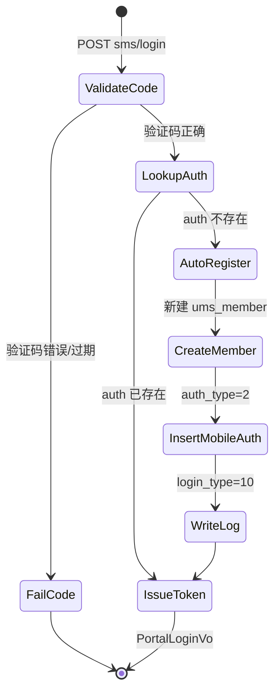
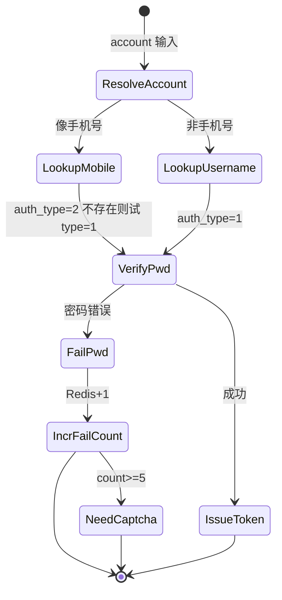
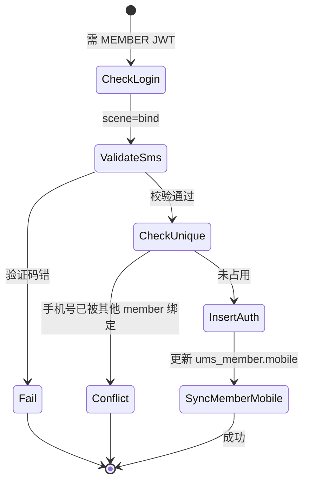
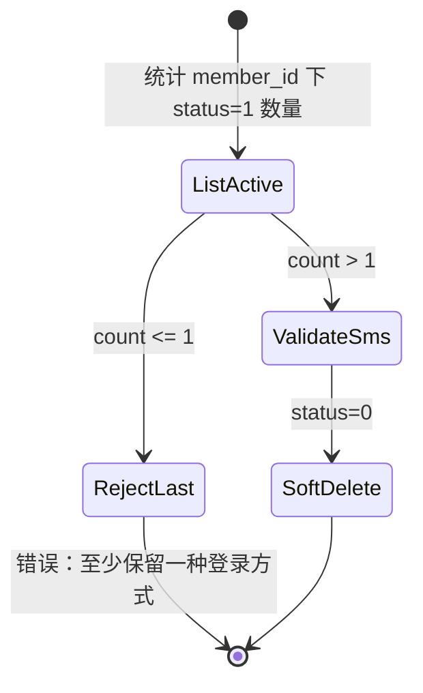
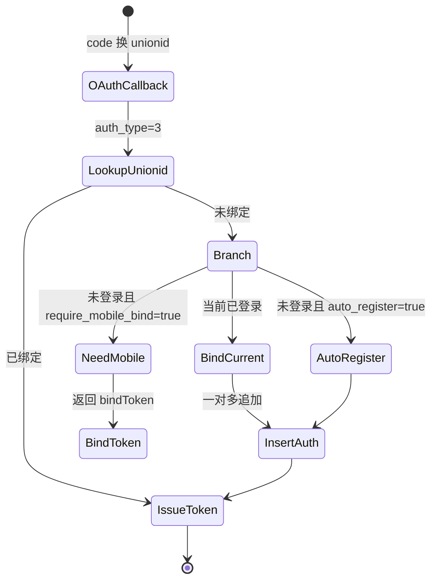

# C 端会员认证 P1 设计：一对多绑定 + 短信登录

> 模块：`starpivot-mall` · 前端：`star-pivot-ui/views/portal`  
> 范围：**P1** — 绑定表、密码/短信登录、绑定管理基础能力；微信/QQ 在 P2 按同一模型扩展。  
> DDL：`sql/patch_portal_member_auth.sql`

---

## 1. 目标与原则

### 1.1 P1 交付范围

| 包含 | 不包含（P2+） |
|------|----------------|
| `ums_member_auth` 一对多绑定表 | 微信 OAuth 完整接入 |
| 密码登录改造（走绑定表） | QQ / 支付宝 / Apple |
| 手机号 + 短信验证码登录 | PC 微信扫码 |
| 发送验证码 + 限流 | 独立 notify 微服务 |
| 登录配置接口 | 账号合并 UI 完整流程 |
| 已登录：查绑定列表、绑手机、设密码 | 解绑微信/QQ（P2 有第三方后再做） |
| 登录日志写入 `ums_member_login_log` | |

### 1.2 核心原则

1. **一个会员账号 ↔ 多种登录方式（1:N）**  
   同一 `member_id` 可同时拥有：密码 + 手机号 +（后续）微信 + QQ …

2. **一种凭证 ↔ 一个会员（全局唯一）**  
   `(auth_type, identifier)` 唯一；同一手机号/unionid 不能绑两个账号。

3. **统一登录出口**  
   任意方式验证通过后调用 `issueMemberToken(member)` → 返回现有 `PortalLoginVo`。

4. **B/C 隔离**  
   C 端认证 API 前缀 `/portal/auth/**`，不复用 `/auth/login`（后台 sys_user）。

---

## 2. 数据模型

### 2.1 ER 关系

```mermaid
erDiagram
  UMS_MEMBER ||--o{ UMS_MEMBER_AUTH : binds
  UMS_MEMBER ||--o{ UMS_MEMBER_LOGIN_LOG : logs
  UMS_MEMBER {
    bigint id PK
    varchar username
    varchar mobile
    varchar password "迁移期保留，新写入以 auth 为准"
    tinyint source_type
    tinyint status
  }
  UMS_MEMBER_AUTH {
    bigint id PK
    bigint member_id FK
    tinyint auth_type
    varchar identifier UK_with_type
    varchar credential
    json extra_json
    tinyint status
  }
```

### 2.2 `auth_type` 枚举

| 值 | 常量 | identifier | credential | P1 |
|----|------|------------|------------|-----|
| 1 | PASSWORD | username | BCrypt 哈希 | ✅ |
| 2 | MOBILE | 11 位手机号 | NULL | ✅ |
| 3 | WECHAT | unionid（无则 openid） | NULL | P2 |
| 4 | QQ | unionid / openid | NULL | P2 |
| 5 | ALIPAY | user_id | NULL | P3 |
| 6 | APPLE | sub | NULL | P3 |
| 7 | EMAIL | 邮箱 | 可选 | P3 |

Java 建议：`PortalAuthType` 枚举 + `PortalAuthConstants`。

### 2.3 `extra_json` 示例

```json
{
  "unionid": "o6_bmjrPT...",
  "openid": "oUpF8uMu...",
  "appId": "wx....",
  "nickname": "微信昵称",
  "avatar": "https://..."
}
```

### 2.4 `ums_member_login_log.login_type`

| 值 | 含义 |
|----|------|
| 1 | 密码登录 |
| 2 | 短信验证码登录 |
| 3 | 微信（P2） |
| 4 | QQ（P2） |
| 10 | 自动注册（首次短信/第三方建号） |

### 2.5 迁移说明

执行 `sql/patch_portal_member_auth.sql` 后：

- 现有 `username + password` → `auth_type=1`
- 现有 `mobile` → `auth_type=2`
- 现有 `social_uid` → `auth_type=3`（遗留数据，P2 接入微信后以 unionid 为准）

`ums_member.password` **迁移期双写**，新代码以 `ums_member_auth` 为准；稳定后可停写 member 表密码字段。

---

## 3. Redis 设计

| Key | 类型 | TTL | 说明 |
|-----|------|-----|------|
| `mall:portal:sms:code:{scene}:{mobile}` | String | 5min | 验证码，校验后 DEL |
| `mall:portal:sms:interval:{mobile}` | String | 60s | 发送间隔锁 |
| `mall:portal:sms:daily:mobile:{mobile}:{yyyyMMdd}` | String | 25h | 单号日计数 |
| `mall:portal:sms:daily:ip:{ip}:{yyyyMMdd}` | String | 25h | 单 IP 日计数 |
| `mall:portal:login:fail:{identifier}` | String | 30min | 密码失败次数 |
| `mall:portal:oauth:state:{state}` | String | 5min | OAuth CSRF（P2） |
| `mall:portal:bind:token:{token}` | String | 10min | 第三方待绑手机临时态（P2） |

### 3.1 限流默认值（Nacos 可覆盖）

```yaml
starpivot:
  mall:
    portal-auth:
      sms:
        code-length: 6
        code-ttl-seconds: 300
        send-interval-seconds: 60
        daily-limit-per-mobile: 10
        daily-limit-per-ip: 50
        mock-enabled: true          # 开发环境
        mock-code: "123456"
      password:
        max-fail-count: 5           # 超过后需图形验证码
        lock-minutes: 30
      require-mobile-bind: false    # P2 第三方是否强制绑手机
```

---

## 4. 后端包结构（建议）

```
cn.org.starpivot.mall.portal
├── auth/
│   ├── PortalAuthType.java
│   ├── PortalAuthController.java          # 匿名：登录、发短信、配置
│   ├── PortalMemberAuthController.java    # 需登录：绑定管理
│   ├── domain/
│   │   ├── bo/   PortalSmsSendBo, PortalSmsLoginBo, PortalPasswordLoginBo, ...
│   │   └── vo/   PortalAuthConfigVo, PortalMemberAuthVo, PortalLoginVo(已有)
│   ├── entity/UmsMemberAuth.java
│   ├── mapper/UmsMemberAuthMapper.java
│   ├── service/
│   │   ├── PortalAuthService.java         # 登录编排
│   │   ├── PortalMemberAuthService.java   # 绑定 CRUD
│   │   ├── PortalSmsService.java
│   │   └── PortalTokenService.java        # issueMemberToken
│   └── sms/
│       ├── SmsSender.java
│       └── MockSmsSender.java / AliyunSmsSender.java
```

---

## 5. API 清单

统一响应：`Result<T>`。  
外部 URL 前缀：`/api/v1/portal/...`（网关 context-path）。

### 5.1 配置（匿名）

#### `GET /portal/auth/config`

返回前端登录页开关。

**Response `PortalAuthConfigVo`**

```json
{
  "passwordLogin": true,
  "smsLogin": true,
  "wechatLogin": false,
  "qqLogin": false,
  "smsMockEnabled": true,
  "captchaRequired": false
}
```

---

### 5.2 短信（匿名，网关白名单）

#### `POST /portal/auth/sms/send`

**Request `PortalSmsSendBo`**

| 字段 | 类型 | 必填 | 说明 |
|------|------|------|------|
| mobile | string | ✅ | 11 位手机号 |
| scene | string | ✅ | `login` / `bind` / `set_password` |
| captchaToken | string | 条件 | 失败次数或配置开启时必填 |
| captcha | string | 条件 | 图形验证码 |

**Response**：`{ "expireSeconds": 300 }`

**错误码**

| message | 说明 |
|---------|------|
| 发送过于频繁 | 60s 内重复 |
| 今日发送次数已达上限 | 日限流 |
| 验证码错误 | captcha 校验失败 |

---

#### `POST /portal/auth/sms/login`

**Request `PortalSmsLoginBo`**

| 字段 | 类型 | 必填 |
|------|------|------|
| mobile | string | ✅ |
| code | string | ✅ |

**Response**：`PortalLoginVo`（与现网一致）

```json
{
  "token": "eyJ...",
  "member": { "id": 1, "username": "m_8000_x7k2", "mobile": "13800138000", "nickname": "用户8000" }
}
```

**业务逻辑**

1. 校验 Redis 验证码 → 删除 key  
2. `findAuth(MOBILE, mobile)`  
3. **已绑定** → 更新 `last_login` → 签发 JWT  
4. **未绑定** → 自动注册会员 + 插入 `auth_type=2` + 写 `login_type=10` 日志  

---

### 5.3 密码登录（匿名，兼容旧路径）

#### `POST /portal/auth/login/password`

**Request**

| 字段 | 类型 | 必填 |
|------|------|------|
| account | string | ✅ | username 或 mobile |
| password | string | ✅ |
| captchaToken | string | 条件 |
| captcha | string | 条件 |

**Response**：`PortalLoginVo`

**逻辑**

1. 若 `account` 匹配手机号格式 → 先查 `auth_type=2`，否则查 `auth_type=1`  
2. 校验 `credential`（BCrypt）  
3. 失败计数 Redis；超阈值要求 captcha  

> **兼容**：保留 `POST /portal/member/login` 委托到新实现，标记 `@Deprecated`。

---

### 5.4 注册（匿名，可选 P1 保留）

#### `POST /portal/member/register`（现有）

P1 改造：注册成功后 **同时写入** `ums_member_auth`：

- `auth_type=1`, `identifier=username`
- 若填 mobile：`auth_type=2`, `identifier=mobile`

---

### 5.5 绑定管理（需会员 JWT）

#### `GET /portal/member/auth/bindings`

**Response `List<PortalMemberAuthVo>`**

```json
[
  { "authType": 1, "authTypeLabel": "密码", "identifier": "zhangsan", "maskedIdentifier": "zhan***", "bindTime": "2026-01-01 10:00:00" },
  { "authType": 2, "authTypeLabel": "手机号", "identifier": "13800138000", "maskedIdentifier": "138****8000", "bindTime": "2026-02-01 12:00:00" }
]
```

---

#### `POST /portal/member/auth/bind/mobile`

已登录会员绑定新手机号（一对多追加）。

| 字段 | 必填 |
|------|------|
| mobile | ✅ |
| code | ✅ |

**规则**

- 手机号未被其他会员绑定  
- 验证码 scene=`bind`  
- 插入 `auth_type=2`；同步更新 `ums_member.mobile`（展示用）

---

#### `POST /portal/member/auth/set-password`

为「仅短信注册、无密码」的会员设置密码。

| 字段 | 必填 |
|------|------|
| password | ✅ |
| code | ✅（短信验证，scene=`set_password`） |

**规则**

- 若已有 `auth_type=1` → 走「修改密码」  
- 若无 → 新建 `auth_type=1`，`identifier=member.username`

---

#### `DELETE /portal/member/auth/unbind/{authType}`（P1 仅支持解绑手机）

| 字段 | 必填 |
|------|------|
| code | ✅（短信验证，scene=`unbind`） |

**规则**

- 解绑后至少保留 **1** 种 `status=1` 的登录方式  
- 软删：`status=0`，保留审计

---

### 5.6 网关 / Security 白名单追加

```yaml
# GatewayAuthProperties + MallSecurityConfig permitAll
/api/v1/portal/auth/config
/api/v1/portal/auth/sms/**
/api/v1/portal/auth/login/password
# 兼容旧路径
/api/v1/portal/member/register
/api/v1/portal/member/login
```

绑定管理接口 **不在白名单**，需 `MEMBER` JWT。

---

## 6. 状态机

### 6.1 短信登录



---

### 6.2 密码登录



---

### 6.3 绑定手机号（已登录，一对多追加）



---

### 6.4 解绑（至少保留一种方式）



---

### 6.5 第三方登录 + 绑定（P2 预留，与 P1 同表）



---

## 7. 核心服务伪代码

### 7.1 签发 Token（复用现网）

```java
public PortalLoginVo issueMemberToken(UmsMember member) {
    LoginUser loginUser = LoginUser.builder()
        .userId(member.getId())
        .username(member.getUsername())
        .roles(List.of(PortalConstants.MEMBER_ROLE))
        .build();
    String token = JwtUtils.createToken(loginUser, jwtProperties);
    // 写 ums_member_login_log
    return new PortalLoginVo(token, toVo(member));
}
```

### 7.2 自动注册（短信首次登录）

```java
public UmsMember registerByMobile(String mobile) {
    UmsMember member = new UmsMember();
    member.setUsername(generateUsername(mobile));  // m_8000_x7k2
    member.setNickname("用户" + mobile.substring(7));
    member.setMobile(mobile);
    member.setPassword(randomUnusablePassword());   // 占位，不可用于登录
    member.setStatus(1);
    member.setSourceType(3); // 手机注册
    umsMemberMapper.insert(member);

    insertAuth(member.getId(), MOBILE, mobile, null);
    return member;
}
```

### 7.3 绑定唯一性校验

```java
public void assertIdentifierAvailable(PortalAuthType type, String identifier, Long excludeMemberId) {
    UmsMemberAuth existing = authMapper.selectActive(type, identifier);
    if (existing != null && !existing.getMemberId().equals(excludeMemberId)) {
        throw new BizException("该" + type.getLabel() + "已绑定其他账号");
    }
}
```

---

## 8. 前端改造要点（P1）

### 8.1 登录页 `/portal/login`

| Tab | 调用 |
|-----|------|
| 密码登录 | `POST /portal/auth/login/password` |
| 验证码登录 | 发送 `POST /portal/auth/sms/send` → 登录 `POST /portal/auth/sms/login` |

页面加载：`GET /portal/auth/config` 控制 Tab 与第三方入口显隐。

### 8.2 新增页面（可选 P1 末）

`/portal/account/security` — 账号安全

- 已绑定方式列表  
- 绑定手机号  
- 设置登录密码  

### 8.3 API 文件

```
star-pivot-ui/src/api/portal/
├── auth.ts      # 新增
├── member.ts    # 保留 info；login 逐步迁到 auth.ts
└── types.ts     # PortalAuthConfigVo, PortalMemberAuthVo, ...
```

---

## 9. 测试用例（P1 验收）

| # | 场景 | 预期 |
|---|------|------|
| 1 | 新手机号 + 正确验证码 | 自动注册，返回 token，auth 表 1 条 type=2 |
| 2 | 已注册手机号 + 验证码 | 直接登录，member_id 不变 |
| 3 | 错误验证码 | 401/业务错误，不消费验证码 |
| 4 | 60s 内重复发送 | 拒绝 |
| 5 | 密码登录 username | 走 auth_type=1 |
| 6 | 密码登录 mobile | 走 auth_type=2 或 1 |
| 7 | 已登录绑新手机 | auth 表多 1 条，同一 member_id |
| 8 | 绑已被占用的手机 | 拒绝 |
| 9 | 解绑唯一登录方式 | 拒绝 |
| 10 | 解绑手机后仍可用密码登录 | 成功 |
| 11 | 执行迁移 SQL 后旧会员密码登录 | 与迁移前行为一致 |
| 12 | mock 模式 dev 下 code=123456 | 可登录 |

### 9.1 本地 mock 短信

```yaml
starpivot.mall.portal-auth.sms.mock-enabled: true
starpivot.mall.portal-auth.sms.mock-code: "123456"
```

不调用真实短信网关，Redis 仍写入便于测过期/错误码。

---

## 10. 实施步骤（开发顺序）

| 步骤 | 内容 | 依赖 |
|------|------|------|
| 1 | 执行 DDL + 迁移 SQL | — |
| 2 | Entity / Mapper / AuthType 枚举 | 1 |
| 3 | `PortalTokenService` + 登录日志 | 2 |
| 4 | 密码登录改造 + 旧接口兼容 | 3 |
| 5 | SMS 发送 + 限流 + MockSender | Redis |
| 6 | 短信登录 + 自动注册 | 5 |
| 7 | 网关 / Security 白名单 | 6 |
| 8 | 绑定列表 / 绑手机 / 设密码 | 6 |
| 9 | 前端登录 Tab + auth API | 7 |
| 10 | 账号安全页（可选） | 8 |
| 11 | 联调 + 文档更新 `docs/商城开发事项.md` | 9 |

预估：**5~7 人日**（不含真实短信 SDK 与图形验证码对接）。

---

## 11. P2 扩展检查表（同一模型，无需改表）

- [ ] `POST /portal/auth/wechat/login` + `bind/wechat`  
- [ ] `POST /portal/auth/qq/login`  
- [ ] `DELETE /portal/member/auth/unbind/3`（微信）  
- [ ] `ums_member_auth.extra_json` 存 unionid + openid  
- [ ] 登录页微信图标 + 回调页 `/portal/login/wechat/callback`  

---

## 12. 相关文件

| 文件 | 说明 |
|------|------|
| `sql/patch_portal_member_auth.sql` | 建表 + 历史迁移 |
| `starpivot-mall/.../portal/service/impl/PortalMemberServiceImpl.java` | 现有登录实现（改造入口） |
| `starpivot-gateway/.../GatewayAuthProperties.java` | 白名单 |
| `star-pivot-ui/src/views/portal/auth/login.vue` | C 端登录页 |

---

**文档版本**：P1 v1.0 · 2026-06-30
