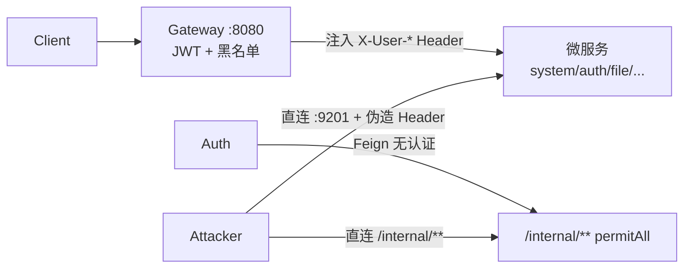

# starpivot-cloud 代码审查报告

基于对 `starpivot-gateway`、`starpivot-auth`、`starpivot-common`、`starpivot-system`、`starpivot-file`、`starpivot-generator`、`starpivot-monitor` 等后端模块的审查，共发现 **约 35 项问题**（Critical 6、High 12、Medium 12、Low 5+）。整体架构清晰，但当前安全模型过度依赖「所有流量必经网关、内网完全可信」这一假设，生产环境一旦不成立，会出现严重漏洞。

---

## 架构概览



**鉴权链路（设计意图）：**

- 登录：Client → Gateway → Auth → Feign → System(`/internal/user`) → MySQL
- 业务：Client → Gateway(JWT 校验) → 微服务(携带 `X-User-*` 请求头)

**做得好的地方：**

- BCrypt 密码加密、JWT + Redis 黑名单、网关 `InternalPathBlockFilter` 拦截经网关访问的 `/internal/**`
- 多数管理接口使用 `@PreAuthorize('hasAuthority(...)')`
- 用户分页列表在 `UserVOAssembler.convertToVOList` 中做了批量加载，避免 N+1
- `DataScopeService` 在用户列表等场景应用了数据权限过滤

---

## Critical（必须优先修复）

| 严重度   | 位置                                                               | 问题                                                                                                                |
| -------- | ------------------------------------------------------------------ | ------------------------------------------------------------------------------------------------------------------- |
| Critical | `SystemSecurityConfig.java:30-38` + `controller/internal/*.java`   | `/internal/**` 全部 `permitAll()`，无服务间认证。直连 9201 端口可：注册用户、获取密码哈希、清空操作日志             |
| Critical | `GatewayAuthenticationFilter.java:56-74`                           | 无条件信任 `X-User-Id` / `X-User-Name` / `X-User-Roles`。绕过网关直连微服务即可伪造任意身份                         |
| Critical | `SysUserController.java:72-78` + `SysUserServiceImpl.java:160-191` | **自更新提权**：普通用户可通过 `canUpdateUser` 路径修改自己，若请求体带 `roleIds`/`postIds`，可给自己分配高权限角色 |
| Critical | `SysUserServiceImpl.java:171`                                      | 自更新时 `BeanUtils.copyProperties` 会复制 `status`、`deptId` 等敏感字段，普通用户可能修改自身状态/部门             |
| Critical | 各模块 `application.yml` + `JwtProperties.java`                    | JWT Secret、OSS AccessKey 硬编码在仓库默认值中，未设环境变量时任何人可伪造 JWT 或访问 OSS                           |
| Critical | `SysUserInternalController` + `SysUserAuthDto`                     | 内部接口返回 BCrypt 密码哈希，内网被突破即构成凭据泄露面                                                            |

**关键代码示例：**

```30:38:e:\star-pivot\project0422\starpivot-cloud\starpivot-system\src\main\java\cn\org\starpivot\system\config\SystemSecurityConfig.java
                        .requestMatchers(
                                "/internal/**",
                                "/actuator/**",
                                "/doc.html",
                                "/swagger-ui/**",
                                "/v3/api-docs/**",
                                "/webjars/**",
                                "/health"
                        ).permitAll()
```

```56:74:e:\star-pivot\project0422\starpivot-cloud\starpivot-system\src\main\java\cn\org\starpivot\system\filter\GatewayAuthenticationFilter.java
    private void authenticateWithGatewayHeaders(HttpServletRequest request) {
        String userIdHeader = request.getHeader(SecurityConstants.USER_ID_HEADER);
        String username = request.getHeader(SecurityConstants.USER_NAME_HEADER);
        if (!StringUtils.hasText(userIdHeader) || !StringUtils.hasText(username)) {
            return;
        }
        // ... 直接建立 SecurityContext，无网关签名校验
```

---

## High（高优先级）

| 严重度 | 位置                                           | 问题                                                                                                         |
| ------ | ---------------------------------------------- | ------------------------------------------------------------------------------------------------------------ |
| High   | `application.yml:151-152` + `RouterController` | `/router/dynamic-routes` 在网关白名单，跳过 JWT；配合 Header 伪造可读取任意用户路由                          |
| High   | `application.yml:14-17`                        | `discovery.locator.enabled: true` 自动暴露 `/starpivot-system/**` 等直连路径，扩大攻击面                     |
| High   | `AuthService.java:50-63`                       | 登录未校验 `captchaProof`，验证码流程形同虚设，无速率限制/账户锁定                                           |
| High   | `application.yml:53-58`                        | v1 路由 `StripPrefix=2` 可能导致 `/api/v1/system/**` 路径映射错误（应为 3，与 auth-v1 不一致）               |
| High   | 两个 `SecurityUtils.java`                      | `utils.SecurityUtils` 从 `login_user` attribute 取值，但全项目无人设置，导致 `createBy`/`updateBy` 恒为 null |
| High   | `RefreshTokenService`                          | refresh 校验与 revoke 非原子，并发 refresh 可能双发 token                                                    |
| High   | 各微服务 Filter                                | 下游服务不校验 Token 黑名单，登出后 token 在 system/file 等仍有效至过期                                      |
| High   | `MonitorSecurityConfig` + `application.yml`    | Druid 监控台 `/druid/*` 为 `permitAll()`，默认 `admin/admin`                                                 |
| High   | `SysUserController` + `SysUserServiceImpl`     | `GET /sys/user/{userId}` 无数据范围校验，有 query 权限的用户可 IDOR 枚举范围外用户                           |
| High   | `SysUserServiceImpl.java:136-138`              | 新建用户默认密码 `Star123456`，无复杂度策略                                                                  |
| High   | `docker-compose.yml`                           | MySQL/Redis/RabbitMQ/Nacos 默认弱口令，端口映射宿主机                                                        |

---

## Medium（中优先级）

| 类别           | 问题                                                                                                              |
| -------------- | ----------------------------------------------------------------------------------------------------------------- |
| **性能**       | `GatewayAuthenticationFilter` 每请求 DB 加载权限；`selectByUserId` 存在 N+1；部门树递归、角色/菜单删除存在 N+1    |
| **事务**       | `resetUserPassword`、`updateUserPassword`、`changeRoleStatus`、`assignUser` 缺少 `@Transactional`                 |
| **数据一致性** | 软删除用户未清理 `sys_user_role`/`sys_user_post`；`getUserMenus` 与 `getMenuByUserId` 菜单过滤逻辑不一致          |
| **Feign**      | 无 fallback/超时配置；认证失败与依赖不可用被统一映射为「用户名或密码错误」                                        |
| **异常处理**   | 网关返回 HTTP 401，`GlobalExceptionHandler` 对 `BusinessException(401)` 返回 HTTP 200 + body code 401，格式不统一 |
| **代码生成器** | `${sql}` 动态 DDL，虽有 keyword 过滤但仍属高危模式                                                                |
| **文件上传**   | 仅校验 Content-Type/扩展名，无魔数检测；预签名 URL 按前缀授权存在 IDOR 风险                                       |
| **运维**       | MyBatis `StdOutImpl` 可能在生产打印 SQL；JDBC `useSSL=false`                                                      |

---

## Low（低优先级）

- `InternalPathBlockFilter` 用 `contains("/internal/")` 而非规范路径匹配
- `/user/info` 在 Security 层 `permitAll()`，职责分散
- `RouterController` 存在不可达的死代码分支
- `DashboardController` 返回 mock 数据，无 `@PreAuthorize`
- 导出上限 5000 条静默截断，无提示

---

## 建议修复顺序（Top 7）

1. **内部 API 鉴权** — 为 `/internal/**` 增加 `X-Internal-Token` 或 mTLS；内部 DTO 去掉 password 字段
2. **消除 Header 伪造** — 网关 strip 客户端同名 Header 后重写；微服务仅信任带签名的网关来源
3. **修复自更新提权** — 自更新路径白名单字段（nickName、email、phonenumber、sex、avatar），禁止普通用户提交 `roleIds`/`postIds`/`status`/`deptId`
4. **密钥管理** — 轮换已泄露密钥；无 env 时启动失败；从 Git 历史清除
5. **收紧网关** — 白名单移除 `/router/dynamic-routes`；生产关闭 `discovery.locator`；缩小 Actuator/Swagger 暴露
6. **登录安全** — 启用验证码校验 + IP/用户名限流 + 密码复杂度策略
7. **修复 v1 路由** — `starpivot-system-v1` 的 `StripPrefix` 改为 3；合并重复的 `SecurityUtils`

---

## 总结

| 维度     | 评价                                                                          |
| -------- | ----------------------------------------------------------------------------- |
| 架构     | Spring Cloud Alibaba 微服务拆分合理，Feign 跨服务调用清晰                     |
| 安全     | **当前最大风险是「内网可信 + Header 信任」模型**，Critical 项需在上生产前解决 |
| 业务逻辑 | 用户自更新提权、数据权限缺口是业务层最严重 bug                                |
| 代码质量 | 整体规范，但存在重复工具类、事务/异常处理不一致                               |
| 运维配置 | 开发默认值过多，生产需强制环境变量与网络隔离                                  |

如需我按上述优先级直接改代码，可切换到 Agent 模式并指定要先修哪几项（例如：内部 API 鉴权、自更新提权、网关白名单）。
